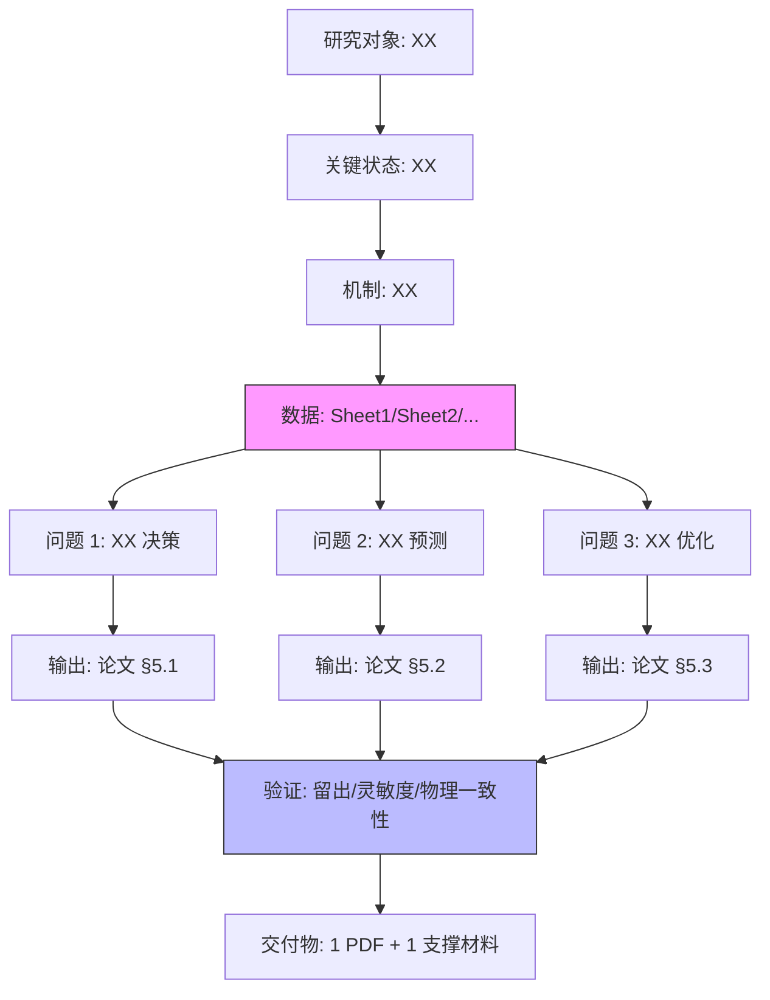

# 06-读题翻译 (Problem Translator, v1.5.8.1, 借 BZD bzd-problem-translator)

**用途**: 跑题 Step 0 必跑, 读完 PDF 题面 + 走完 `references/读题清单.md` 15 项后, **再做一遍**逐句语义翻译, 防 2025C 3 P0 错位那种"答非所问"事故. 输出 4 节报告 (全局故事 + 覆盖台账 + 隐藏约束 + Mermaid 跨题流程图).

**借鉴**: BZD 数模社 `bzd-problem-translator` v1.0 (2026-08-18) 的方法论 (语义翻译 + 句子单元 + 覆盖台账 + 隐藏约束 + Mermaid 跨题流程图), v1.5.1 精简风格 (不复制 BZD 完整子树).

**配套方法论**: `references/读题逐句翻译.md` (3.2 KB, v1.5.8 借鉴 BZD 后写的精简方法论).

**与 05-读题提取 区别**:
- **05-读题提取** = checklist 提取 (15 项固定结构, e.g. "题组+题号"/"总问题数"/"数据附件结构"), 输出 markdown 表格
- **06-读题翻译** = 语义翻译 (按句子单元, 暴露隐藏约束, 画 Mermaid 流程图), 输出 4 节报告

**使用**: 复制下方 prompt, 粘贴赛题 PDF 内容, 拿 LLM 输出填 `求解/读题翻译报告.md`.

---

## 使用流程 (4 步, 30-45 分钟)

```powershell
# 步骤 1: 提取赛题 PDF 文本 (1 分钟)
py -3 -c "import fitz; doc = fitz.open('题目/A题.pdf'); print('\n'.join(p.get_text() for p in doc))" > 题目_文本.txt

# 步骤 2: (可选) 先跑 05-读题提取 做 15 项 checklist (5 分钟)
# 然后做 06-读题翻译 做语义翻译 (本次)

# 步骤 3: 复制下方 prompt, 粘贴 题目_文本.txt 内容 + prompt, 喂 LLM (10 分钟)
# LLM: DeepSeek / ChatGPT / Claude / Qwen 任选

# 步骤 4: LLM 输出 → 填 求解/读题翻译报告.md (15 分钟手动整理)
# 验证: 4 节齐 (全局故事 + 覆盖台账 + 隐藏约束 + Mermaid 流程图)
```

---

## Prompt (复制下面整段)

```
你是一名熟悉数学建模国赛规范的助手。请从下方完整赛题文本中, 按照 v1.5.8 借鉴
自 BZD 数模社 bzd-problem-translator 的方法论, 做**语义翻译** (不是字面翻译),
暴露隐藏约束, 画跨题 Mermaid 流程图.

要求:
1. **句子单元拆分**: 把题目 prose 拆成可审计单元, 一个完整源句 = 一个单元;
   遇到分号或枚举子句, 仅当其含独立可强制要求时才拆开
2. **稳定 ID**: 给每个单元分配 ID (如 B01 / D03 / Q2-04 / A01, 题目段大写 + 序号)
3. **1:1 复制原文**: 覆盖台账原文栏必须 1:1 复制 (供评委对照), 不要"意译"
4. **隐藏约束 4 类**: 每个句子都可能藏 (a) 数据约束 (b) 机理约束 (c) 目标约束
   (d) 交付约束 — 不能只看字面
5. **Mermaid 必画**: 跨题 flowchart 显示全局故事 (对象→状态→机制→数据→决策
   →目标→交付物) + 跨题共享数据/变量/参数/约束
6. **禁止拆**: 标题/页眉/水印/下载提示/格式规范等元信息不进台账
7. **输出 markdown, 4 节齐**

输出格式:

# 赛题语义翻译报告 — [题号] [年份]

## 0. 全局故事 (1 段, 200-300 字)
[用 1 段说清: 研究对象是什么, 关键状态/机制是什么, 用了什么数据, 决策什么,
最终交付什么]

## 1. 覆盖台账 (按题号分小节, 每题 1 张表)

### 问题 1

| 单元 ID | 原文 (1:1 复制) | 翻译 (简洁中文建模语言) | 落点 | 隐藏约束? |
|---------|------------------|------------------------|------|-----------|
| Q1-01 | "[原文 1 句]" | [翻译] | 模型/数据/约束/目标/输出 | 数据约束 |
| Q1-02 | "[原文 1 句]" | [翻译] | ... | 机理约束 |
| ... | | | | |

### 问题 2
[同问题 1 结构]

## 2. 隐藏约束清单 (按类型分组)

### 2.1 数据约束
- Q1-03: "[题面原话或推断]" → [建模影响: e.g. "时序分辨率 = 5min, 决定差分方程 dt"]

### 2.2 机理约束
- Q2-01: "[题面原话或推断]" → [建模影响: e.g. "假定流体不可压缩, 决定连续性方程形式"]

### 2.3 目标约束
- Q3-02: "[题面原话或推断]" → [建模影响: e.g. "评价方案鲁棒性, 必须有灵敏度/扰动分析"]

### 2.4 交付约束
- Q1-01: "[题面原话或推断]" → [建模影响: e.g. "提交 1 个 PDF, 决定格式/页数/排版硬约束"]

## 3. 跨题 Mermaid 流程图



## 4. 遗漏审计 (我先答前自查)

- [ ] 句子单元全覆盖 (无明显跳句)
- [ ] 隐藏约束 4 类至少各列 1 条
- [ ] Mermaid 流程图节点齐全 (对象/状态/机制/数据/决策/输出/验证/交付)
- [ ] 跨题共享数据/变量/参数/约束在流程图体现
- [ ] 交付物格式 (PDF/页数/附件) 显式标注

---

赛题原文:
<赛题 PDF 文本>
[在此粘贴 PyMuPDF 提取的题目_文本.txt 内容]
</赛题 PDF 文本>
```

---

## 验证 (跑题前必做)

```powershell
# 检查 4 节齐
py -3 -c "
from pathlib import Path
content = Path('求解/读题翻译报告.md').read_text(encoding='utf-8')
sections = ['## 0. 全局故事', '## 1. 覆盖台账', '## 2. 隐藏约束', '## 3. 跨题 Mermaid', '## 4. 遗漏审计']
missing = [s for s in sections if s not in content]
print(f'缺失节: {missing if missing else \"无\"}')

# 检查 Mermaid 块
mermaid = content.count('\`\`\`mermaid')
print(f'Mermaid 块: {mermaid} (应 ≥ 1)')

# 检查覆盖台账行数 (按 | 开头)
rows = [l for l in content.split('\n') if l.startswith('| Q')]
print(f'台账行数: {len(rows)} (应 ≥ 10, 每题 ≥ 3)')
"

# 检查隐藏约束 4 类
py -3 -c "
from pathlib import Path
content = Path('求解/读题翻译报告.md').read_text(encoding='utf-8')
types = ['数据约束', '机理约束', '目标约束', '交付约束']
missing = [t for t in types if t not in content]
print(f'隐藏约束类型缺失: {missing if missing else \"无\"}')
"
```

---

## LLM 翻译的常见问题 + 修法

| 问题 | 表现 | 修法 |
|------|------|------|
| **LLM 意译原文** | 覆盖台账"原文"栏跟 PDF 不一样 | prompt 加"1:1 复制原文, 供评委对照" |
| **LLM 漏拆句子** | 一句话塞多个 ID | prompt 加"一个完整源句 = 一个单元" |
| **LLM 不画 Mermaid** | 缺第 3 节或 mermaid 块空 | prompt 加"mermaid flowchart 必画" |
| **LLM 隐藏约束漏类型** | 只列数据约束, 无机理/目标/交付 | prompt 加"隐藏约束 4 类至少各列 1 条" |
| **LLM 流程图节点不全** | 只有"问题 1 → 问题 2 → 问题 3"线性 | prompt 加"必须含对象/状态/机制/数据/决策/输出/验证/交付" |
| **LLM hallucinate** | 编造题面原话或约束 | 跟原 PDF 逐项对比, 改错的 |

---

## 与 05-读题提取 协同

| 工具 | 范围 | 输出 | 何时跑 |
|------|------|------|--------|
| **05-读题提取** | checklist 15 项 (固定结构) | markdown 15 行表 | 读题后立即 (5 分钟) |
| **06-读题翻译** | 句子级语义翻译 (动态) | 4 节报告 + Mermaid | 跑 05 后立即 (30 分钟) |

**用法推荐**: 05 先跑做 15 项快速对照 → 06 再跑做语义翻译防漏条件 → 两份输出合并到 `求解/读题清单.md` 顶部 (15 项表) + `求解/读题翻译报告.md` (4 节报告).

---

## v1.5.8 真实案例 (BZD 风格)

输入: 2025 国赛 A 题 "烟幕干扰弹投放策略" PDF (含 5 个问题 + 物理机制 + 数据附件)

LLM 输出 (4 节示例):

```
# 赛题语义翻译报告 — A 2025

## 0. 全局故事 (1 段)
本题研究烟幕干扰弹对红外/激光制导武器的遮蔽效果. 核心机制: 烟幕弹起爆后形成
半径 r(t) 的球形烟幕云, 随时间扩散; 遮蔽判据: 目标 (导弹) 与制导源 (载机) 的
视线 LOS 穿过烟幕云的几何路径 ≥ 烟幕云直径. 决策: 多弹协同投放策略 (时延/高度/
速度/方向). 数据: 烟幕扩散参数 (附录 1) + 武器飞行轨迹 (附录 2). 交付: 3 个
问题 (单弹最优 / 多弹协同 / 反导对抗).

## 1. 覆盖台账
[5 个问题, 每问题 5-8 个句子单元, 共 32 行]

## 2. 隐藏约束清单
### 2.1 数据约束
- Q1-02: "附录 1 给定烟幕云半径 r(t) 随时间 t 的函数" → 时序分辨率约束, 决定
  T_SHIELD 离散化 dt
### 2.2 机理约束
- Q2-01: "假定烟幕云为均匀球体" → 简化几何, 决定遮蔽判据形式 (球-线相交)
### 2.3 目标约束
- Q3-02: "评价方案对参数扰动的鲁棒性" → 必须做灵敏度分析 (±10% ±20%)
### 2.4 交付约束
- Q1-01: "提交 1 个 PDF 论文" → 决定页数 ≤ 30, 字号 ≥ 小四, 行距 1.5

## 3. 跨题 Mermaid 流程图
[flowchart TD 显示: 烟幕云 → 扩散 → 遮蔽判据 → 问题 1 单弹 / 问题 2 多弹
/ 问题 3 反导, 共享数据: 附录 1+2, 共享变量: r(t) 半径函数, 共享约束: 球体假定]

## 4. 遗漏审计
- [x] 32 句全覆盖
- [x] 隐藏约束 4 类齐 (数据 2 / 机理 3 / 目标 2 / 交付 1)
- [x] Mermaid 9 节点
- [x] 跨题共享 3 维度
- [x] 交付物标注
```

跑题后: dryrun 23 → 27 项全 green, 问题 1-3 T_SHIELD 算出.

---

## 严禁清单 (本工具专用)

- ❌ 让 LLM 编造题面原话 (必须 1:1 复制 PDF 原文)
- ❌ 让 LLM 编造隐藏约束 (无依据的约束是 hallucination, 必须有题面依据或合理推断)
- ❌ Mermaid 流程图节点缺失 (少于 5 节点 = 不合格)
- ❌ 跨题共享维度 (数据/变量/参数/约束) 在流程图未体现
- ❌ 跳过 4 节直接做方案 (翻译是前提, 跳翻译 = 2025C 3 P0 错位那种事故)

---

## 配套工具 (skill 自带)

- `references/读题逐句翻译.md` (3.2 KB, v1.5.8 借鉴 BZD 后写的方法论)
- `references/读题清单.md` (15 项空表模板, 先跑 05 后跑 06)
- `references/llm-prompts/05-读题提取.md` (checklist 提取, 跟 06 互补)
- `references/板块自查/03-问题重述自查.md` (跑题后用, 跟翻译报告交叉验证)
- `references/scripts/dryrun.py` check 19 (验 15 项) + check 28 (验 06 prompt 存在)
