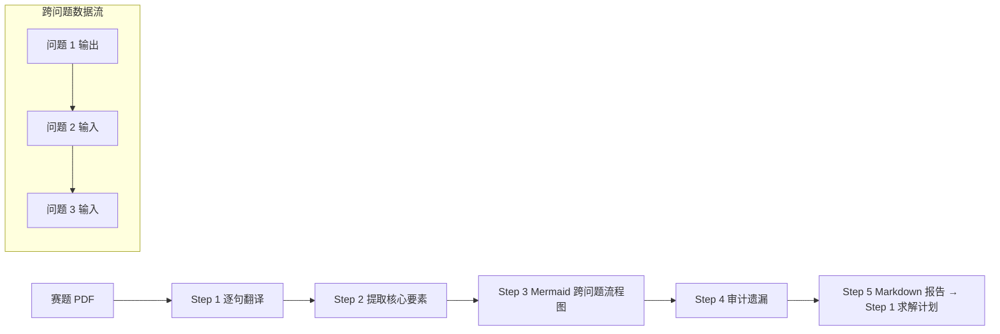

# 题意翻译 (Problem Translator)

> 借鉴 BZD 数模社 `bzd-problem-translator` v1.0 (2026-08-18).
> 逐句翻译赛题为建模语言, 暴露隐含约束, 画 Mermaid 跨问题流程图, 审计遗漏.

## 何时用

- Step 0 读题后, **读完 PDF 第一时间**跑这个 (比写求解计划更早)
- 担忧漏掉题面条件 (BZD 警告: 漏 1 条 = 模型不严谨 = 扣分)
- 跨问题关系不明, 想画 Mermaid 流程图

## 5 步流程 (BZD 标准)

```
Step 1: 逐句翻译 (一题一表)
  - 原文: 题目第 1 段原话
  - 翻译: 精确建模语言 (量化变量 + 显式约束)
  - 暴露: 隐含条件 (如"球赛" 隐含 "主客场制" + "积分规则")

Step 2: 提取核心要素 (一题一表)
  - 任务动词 (建立/优化/预测/分类/评价/机理)
  - 已知 (题面给的数据/条件)
  - 输出 (具体数值/分类/函数/图/文件)
  - 约束 (硬/软, 显式/隐式)

Step 3: 画 Mermaid 跨问题流程图 (强制)
  - 共同数据/预处理 → 哪问
  - 哪问 → 输出 → 哪问输入 → 当作什么用 (参数/初值/约束/验证集)
  - BZD 警告: "问题 1 → 问题 2 → 问题 3" 装饰性链 = 0 信息, 必扣

Step 4: 审计遗漏 (一题一表)
  - 显式遗漏 (题面说 X 但翻译未提)
  - 隐式遗漏 (题面未明说但行业默认, 如"天气"隐含"温湿度风速")
  - 关键假设漏洞 (假设题面忽略某约束, 实际不能忽略)

Step 5: 输出 Markdown 报告 (给后续 Step 1/2/3 用)
```

## 暴露 4 类隐含条件 (BZD 关键洞察)

```
1. 业务默认: 球赛 → 主客场制 + 积分规则 + 黄红牌
2. 物理默认: 烟幕 → 重力 9.8 m/s² + 空气阻力 (低速忽略)
3. 题目措辞: "近期" → 近 3-5 年 (BZD: 不擅自定义"近期"= 近 1 年)
4. 数据来源: "附件" → 默认 xlsx/csv, 不混 docx 表格
```

**BZD 警告**: 隐含条件遗漏 = 评审"题意理解不深" = 扣 1-2 分. 一道题漏 ≥ 2 条 = 黄.

## 跨问题流程图 (Mermaid, 强制)



## 7 大常见错误 (BZD 反例)

1. ❌ **漏 1 条题面条件** (BZD: 必扣, 一字之差可能改变模型)
2. ❌ **不暴露隐含** (BZD: 业务/物理/措辞/数据 4 类至少 3 类)
3. ❌ **不画 Mermaid** (BZD: 跨问题联动必画, 装饰性箭头链 0 信息)
4. ❌ **翻译语言学术化** (BZD: 应是"建模语言", 量化变量 + 显式约束)
5. ❌ **不审计遗漏** (BZD: 翻译 ≠ 隐含条件审计, 必须分开做)
6. ❌ **漏数据来源** (BZD: 附件 xlsx 哪几张 sheet? 哪几列?)
7. ❌ **不写 Markdown 报告** (BZD: 翻译输出要可读, 不能只口述)

## 关联

- `references/题意红线.md` (v1.4.4) — 4 条最高优先级教训 (与题意翻译互补)
- `references/llm-prompts/01-选题推荐.md` — 题目 + 数据 → 候选模型 Top-3 (在题意翻译之后)
- `SKILL.md §Step 0 读取输入` — 第一步是读题, 紧接做题意翻译

## v1.5.2 → v1.5.3 增量

- v1.5.2 有 `references/题意红线.md` (4 条教训, 高层)
- v1.5.3 加本文件 `references/题意翻译.md` (5 步流程 + 7 大错误, 操作级)
- 红线 (高层) + 翻译 (操作级) = 完整题面理解

## 更新记录

- v1.5.3 (2026-09-06) — 借鉴 bzd-problem-translator v1.0 的 5 步流程 + 4 类隐含条件
