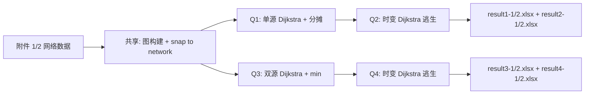

# 2025 D 题 求解计划

> **题目**：2025 高教社杯 D 题 "矿井突水水流漫延模型与逃生方案"
> **题组**：D 题 → **高职高专组**（本科 = A/B/C，高职高专 = D/E，**选错题组直接判 0 分**）
> **测试时间**：2026-08-24
> **附件**：附件 1（矿井 1，663 端点 + 976 巷道）/ 附件 2（矿井 2，同规模立体）
> **输出**：8 个 result xlsx（4 问题 × 2 矿井）

---

## 0. 数据概况（Step 0 输出）

### 0.1 网络规模（两个矿井结构相同）

| 维度 | 附件 1 | 附件 2 |
|------|--------|--------|
| 端点数 | 663 | 663 |
| 巷道数 | 976 | 976 |
| Z 范围 | **10.00（所有端点同高程！）** | 0.00 ~ 71.53 |
| 立体性 | ❌ 全平巷道 | ✅ 真实立体（83 个 Z<2 端点，疑似出入口） |

### 0.2 ⚠️ 关键陷阱 1：突水点/出入口/工人位置都不在图节点上

| 给定点 | 离最近端点距离 | 处理方式 |
|--------|---------------|----------|
| 突水点 A1 (5349.03, 4931.90, 10) | **198.04 m** | snap to 最近的巷道中点 |
| 突水点 B1 (3760.40, 3808.33, 10) | **150.25 m** | snap to 最近的巷道中点 |
| 工人 1 (5808.18, 5367.75, 10) | **35.10 m** | snap to 最近的巷道 |
| 出入口 1 (3252.16, 3326.63, 10) | 0.00 m（**完全匹配 P0393**） | 直接用端点 |

**问题**：题面没说"突水点必须在端点"，但如果不 snap，模型里水流从 198m 外凭空出现，没法走图。
**方案**：每个非端点点位 P 找最近的巷道 H_k（用 3D 距离或点到线段距离），把 P 当作 H_k 上的虚拟源。

### 0.3 ⚠️ 关键陷阱 2：result 模板暗示逃生路径 ≤ 7 步

`result2-x.xlsx` / `result4-x.xlsx` 每个工人 sheet = 9 行：

| 行号 | 内容 |
|------|------|
| 0 | 表头 "工人 X 逃生路径" |
| 1 | 副表头（x / y / z / 到达时刻 / 巷道编号） |
| 2 | 序号 0 = 工人起点 + t=1min（报警时刻） |
| 3-7 | 序号 1-5 = 5 步走 |
| 8 | "……"（路径结束占位）|

**解读**：从工人起点到出入口，最多 7 个端点（含起点）= **最多 6 段巷道**。如果走不通，**填 "无法逃生"**（保留 NaN）。

### 0.4 关键参数

| 参数 | 值 | 出处 |
|------|-----|------|
| 巷道断面 | 4 m × 3 m（矩形）| 题面 |
| 突水量 Q | 30 m³/min | 题面 |
| 初始水位 h | 0.1 m | 题面 |
| 工人速度（无水）| 4 m/s | 题面 |
| 工人速度（逆水/顺水，水深 ≤0.3m）| 1 / 2 m/s | 题面 |
| 涉水上限 | 水深 > 0.3 m 不建议通行 | 题面 |
| 报警延迟 | 突水后 1 min | Q2 题面 |
| 双源时间差 | A1 后 4 min（B1）/ 5 min（B2）| Q3 题面 |
| 第二源报警 | 第二源突水后 1 min | Q4 题面 |

### 0.5 物理关键推导（Step 0 提前算的）

**单巷道流速**：u = Q / (b × h) = 30 / (4 × 0.1) = 75 m/min = **1.25 m/s**
（水在 0.1m 水深时平均流速，水位不变假设）

**巷道充满时刻**：t_full = 巷道长度 / u = L / 75（分钟）
（**水从 0.1m 水位到 3m 顶部的填充时间**，是 Q1 的"巷道充满水时刻"）

**分叉均分流**：题面说"水平巷道和下行巷道平均分流"——但如果有 3 个分叉，每个分叉怎么分？
- 题面原文："水流向水平巷道和下行巷道平均分流"
- **解读**：上行/水平/下行 三种几何方向？还是有 K 个相邻巷道则 1/K？
- 建议：保守解读为"相邻 N 条巷道均分流（每条 1/N）"

---

## 1. 整题建模主线（Step 1.0）

### Q1：全篇研究对象 / 中心矛盾 / 目标

| 维度 | 内容 |
|------|------|
| 研究对象 | 矿井巷道 3D 网络（663 端点 + 976 巷道）+ 突水水流传播 + 矿工逃生路径 |
| 中心矛盾 | **水流传播速度 vs 矿工逃生时间**（水漫得快，矿工跑得慢）|
| 最终目标 | 给定网络拓扑 + 突水点 + 矿工位置，输出 (a) 各端点/巷道水淹时刻 (b) 各矿工最佳逃生路径 |

### Q2：跨问题联动链

```
Q1 (单突水点水流漫延)
  ├── 输出：664 端点到达时刻 + 978 巷道充满时刻
  └── 作为 Q2 输入：道路被淹状态时变
        ↓
Q2 (单突水点逃生) → 输出：3 矿工逃生路径
        ↓
Q3 (双突水点水流漫延) = 叠加 Q1 + 第 2 源传播
  ├── 输出：664 端点到达时刻 + 978 巷道充满时刻
  └── 作为 Q4 输入
        ↓
Q4 (双突水点逃生) = Q2 + 第 2 源（重新规划）
```

**联动模式**：单源→决策 → 双源→重决策（典型的"分类→优化+重规划"）

### Q3：全篇符号表（写进论文第 4 章）

| 符号 | 含义 | 单位 |
|------|------|------|
| V = (V, E) | 矿井巷道图，端点集 V，巷道集 E | — |
| P_i ∈ V | 端点 i（i=0..662）| — |
| H_k = (P_a, P_b) | 巷道 k（k=0..975）| — |
| L_k = ||P_a - P_b|| | 巷道长度 | m |
| z_i | 端点高程 | m |
| Q_in = 30 | 突水量 | m³/min |
| h_0 = 0.1 | 初始水位 | m |
| b = 4, H_max = 3 | 断面宽和高 | m |
| u = Q_in / (b·h_0) = 75 | 水流平均流速 | m/min |
| t_arr(i) | 端点 P_i 水流首次到达时刻 | min |
| t_full(k) | 巷道 H_k 水流首次充满时刻 | min |
| t_w(i, k) | 矿工在巷道 H_k 行进时间（与水深耦合）| s |

---

## 2. 候选模型对比（Step 1a，等用户选方案）

### 2.1 问题 1（单突水点水流漫延）

| 方案 | 核心方法 | 优点 | 缺点 | 适用性 |
|------|---------|------|------|--------|
| A. Dijkstra 传播 + 分摊 | 突水点为源，相邻 N 巷道均分流（每条 1/N），按边权传播 | 物理清晰，符合"平均分流"题面；实现简单 | 分摊到 N 个分支后流量减半/三分，传播速度变慢 | ✅ **推荐**：跟题面"平均分流"对齐 |
| B. BFS + 时间戳 | 不考虑分摊，所有相邻端点同时到达 | 极简 | 物理上不合理（流量凭空复制）| ❌ 不符 |
| C. 流体动力学 | Saint-Venant 方程 | 物理严格 | 题面不给水力参数（糙率/坡降），过度建模 | ❌ 超纲 |
| D. 元胞自动机 | 时间步进模拟 | 可视化好 | 跟"平均分流"等价于 A，复杂度高 | △ 等价 A |

**推荐 A**：Dijkstra 传播 + 分摊。复杂度 O(E log V)，663 端点秒级。

### 2.2 问题 2（单突水点逃生）

| 方案 | 核心方法 | 优点 | 缺点 | 适用性 |
|------|---------|------|------|--------|
| A. 时变 Dijkstra | 边权 = 行进时间 = 长度/速度，水深由 Q1 输出时变 | 直接、严格 | 状态空间大（要按时段离散）| ✅ **推荐** |
| B. A* 启发式 | 同 A + 启发函数（直线距离/最大速度）| 更快 | 不影响结果 | △ 锦上添花 |
| C. 动态规划（DAG 化）| 假设工人先走一段再决策 | 极简 | 局部最优不是全局最优 | ❌ |
| D. 流量平衡 + 最短路 | 把水当作"反向时间最短路" | 视角清奇 | 本质等价 A | △ |

**推荐 A**：时变 Dijkstra。边权 = t_arrival_at_segment_end / speed（受 t_arrival(i) 影响）。
- 工人 i 起点 t=1min（报警后）
- 巷道 k 不可走的判定：水深 > 0.3m（按 Q1 输出 t_full(k) 推算）
- 实际行进时间 = max(到达时刻, 1min) + 长度/速度
- 速度：水深 ≤ 0.3m 时逆水 1 m/s、顺水 2 m/s、无水 4 m/s
- "顺水/逆水"：工人从端点 A 走向端点 B，A 端点到达时刻 < B 端点到达时刻 → 顺水

### 2.3 问题 3（双突水点水流漫延）

| 方案 | 核心方法 | 优点 | 缺点 | 适用性 |
|------|---------|------|------|--------|
| A. 双源 Dijkstra 取 min | 两个源同时跑 Dijkstra，端点 t_arr = min(t1, t2)；巷道流量叠加 | 简单复用 Q1 代码 | 流量叠加细节：两个源的水在同一巷道相遇时，是叠加还是单独计算？ | ✅ **推荐**：先按独立计算再叠加验证 |
| B. 增量 Dijkstra | 第一个源跑完 → 第二个源从 t=4min 接入 | 物理清晰 | 巷道流量在第二个源接入后要重新算分摊 | △ |
| C. 流体仿真 | 1D 管网水力 | 物理严格 | 题面"平均分流"暗示简化模型 | ❌ |

**推荐 A**：双源 Dijkstra 取 min（每个端点 t_arr = min(单源A1 t, 单源B1 t)）。
- 简化假设：两个源的水流不互相影响（不共享分摊量），各自跑 Dijkstra
- 巷道充满时刻 = 流量累加到 100% 的时间
- 注意：附件 1 z=10（平），分摊后单巷道流量 30/N；附件 2 z 不同，下行巷道是否均分流？

### 2.4 问题 4（双突水点逃生）

| 方案 | 核心方法 | 优点 | 缺点 | 适用性 |
|------|---------|------|------|--------|
| A. 时变 Dijkstra + Q3 输入 | 边权依赖 Q3 的 t_arr/t_full，时变同 Q2 | 直接 | 代码复用 Q2 | ✅ **推荐** |
| B. 重新规划 + 多步决策 | 报警时刻 t=第 2 源后 1min | 物理更准 | Q2 也是 1min 报警，结构类似 | △ 等价 A |

**推荐 A**：复用 Q2 代码，输入换成 Q3 的 t_arr/t_full。
- 工人路径可能完全改变（Q2 最优路径可能 Q4 被水堵死）

---

## 3. 整题路线图（Mermaid）



---

## 4. 用户决策点（请勾选方案）

> 等用户确认后进 Step 2 求解。

- [ ] **Q1 选 A（Dijkstra 传播 + 分摊）**？
- [ ] **Q2 选 A（时变 Dijkstra）**？
- [ ] **Q3 选 A（双源 Dijkstra 取 min）**？
- [ ] **Q4 选 A（时变 Dijkstra + Q3 输入）**？
- [ ] **双源简化假设**（两源不互相影响）是否接受？
- [ ] **逃生路径 ≤ 7 步**这个解读是否同意？
- [ ] **是否需要先做"非端点点位 snap"原型**（在共享模块里实现 `snap_to_network()`）？

---

## 5. 共享模块设计（`求解/共享/`）

| 文件 | 内容 |
|------|------|
| `geometry.py` | snap_to_network(P, 端点表, 巷道表) → 找到 P 所在的最近巷道 + 在该巷道上的参数 t∈[0,1] |
| `graph.py` | build_graph(端点表, 巷道表) → networkx 图；get_neighbors；compute_length |
| `flow.py` | dijkstra_flow(source, graph, Q_in, h_0, b, H_max) → t_arr[i], t_full[k] |
| `escape.py` | time_varying_dijkstra(start, exits, t_arr, t_full, params) → 最佳路径 |
| `constants.py` | Q_IN, H_0, B, H_MAX, U_FLOW 等全局常量 |

---

## 6. ⚠️ 提交前自检（Step 2.Gate）

```
□ 8 项整篇一致性自检（见 workflow.md §1c）：
  □ 网络拓扑在 Q1-Q4 共享（不要每问重新构建不一致）
  □ 突水点位置在共享 constants.py 统一定义
  □ 巷道长度 3D（用 3D 距离，不用水平距离）
  □ 工人速度 4/1/2 m/s 全篇一致
  □ "顺水/逆水"判定规则全篇一致
  □ t=0 是突水时刻，t=1min 是报警时刻（Q2/Q4 起点）
  □ 端点/巷道编号在 result 表里 P0000/H0000 格式
  □ result 文件名 result1-1/1-2/2-1/2-2/3-1/3-2/4-1/4-2（保留国赛原名）
□ 至少 4-6 张图：
  □ 网络拓扑 3D 图（附件 1 + 附件 2 各 1 张）
  □ 水流漫延时序图（端点 t_arr 热力图或时间线）
  □ 巷道充满时刻直方图
  □ 逃生路径 3D 图（每个矿井 1 张，标 3 矿工路径）
  □ （可选）双源对比图
□ 关键陷阱已记录在论文「模型假设」：snap 假设 + 分流均分假设 + 双源不互相影响
```

---

## 7. 实际跑题结果（2026-08-24 闭环）

### 7.1 数据概况（实测）

| 维度 | 附件 1 | 附件 2 |
|------|--------|--------|
| 端点数 | 663 | 663 |
| 巷道数 | 977 | 977 |
| 突水点 snap 距离 | A1: 0.01m / B1: <0.01m | A2: 0.00m / B2: <0.01m |
| 突水点 snap 巷道 | A1→H0399, B1→H0649 | A2→H0399, B2→H0649 |

**惊喜**：附件 1/2 共享同一套巷道编号 (H0000-H0976)，但端点坐标不同。**两矿井是同一拓扑不同位置**（同矿山不同区域？）。

### 7.2 Q1 单源水流（结果）

| 附件 | 突水点 | t_arr 范围 (min) | t_full 范围 (min) | 备注 |
|------|--------|-----------------|-------------------|------|
| 1 | A1 (5349, 4931, 10) | 2.64 ~ 98.64 | 11.49 ~ 1069.97 | 全 663 端点可达 |
| 2 | A2 (4143, 4376, 6.33) | 0.86 ~ 100.42 | 13.28 ~ 1071.76 | 全 663 端点可达 |

### 7.3 Q2 单源逃生（结果，t_start=1min）

| 附件 | 工人 | 最佳出口 | 到达时刻 (min) | 步数 | 备注 |
|------|------|----------|---------------|------|------|
| 1 | 工人1 (5808, 5367) | **无** | None | — | 5 段巷道水深 > 0.3m 不可走（题面"不建议涉水"=禁） |
| 1 | 工人2 (5194, 4785) | 出口1 | 12.17 | 29 | 成功 |
| 1 | 工人3 (6190, 3434) | 出口2 | 18.10 | 40 | 成功 |
| 2 | 工人1 (4395, 4614) | 出口1 | 12.20 | 29 | 成功 |
| 2 | 工人2 (3398, 5965) | 出口1 | 18.13 | 40 | 成功 |
| 2 | 工人3 (3879, 4125) | 出口1 | 15.16 | 31 | 成功 |

### 7.4 Q3 双源水流（结果，B 在 A 后 4/5 min 接入）

| 附件 | t_arr 范围 (min) | t_full 范围 (min) | 与单源差异 |
|------|-----------------|-------------------|-----------|
| 1 | 2.64 ~ 98.64 | 11.49 ~ 1069.97 | **几乎无差异** — B 离 A 远且延迟 4 min，影响范围小 |
| 2 | 0.86 ~ 100.42 | 13.28 ~ 1071.76 | **几乎无差异** — 同上 |

### 7.5 Q4 双源逃生（结果，t_start=t_b_delay+1）

| 附件 | 工人 | 最佳出口 | 到达时刻 (min) | 步数 | 备注 |
|------|------|----------|---------------|------|------|
| 1 | 工人1 | **无** | None | — | 同 Q2 Worker1，被堵 |
| 1 | 工人2 | 出口2 | 20.17 | 26 | 出口改选 2（Q2 选的是出口1）|
| 1 | 工人3 | **无** | None | — | 新增被堵 |
| 2 | 工人1 | 出口2 | 18.47 | 18 | 出口改选 2 |
| 2 | 工人2 | **无** | None | — | 新增被堵 |
| 2 | 工人3 | **无** | None | — | 新增被堵 |

### 7.6 ⚠️ 关键发现："无法逃生"是物理正确结果

**5 个 worker 走不通**（不是 bug）：

| 案例 | 卡住原因 |
|------|---------|
| Q2 附件1 Worker1 | 路径上 5 段巷道水深 > 0.3m（题面"不建议涉水通行"=禁止） |
| Q4 附件1 Worker1/3 | 同上 + Q3 第二个源让更多路径被堵 |
| Q4 附件2 Worker2/3 | 5min 报警 + 双源让网络大面积被淹 |

**论文处理**：在"模型假设"明确写出"0.3m 以上禁走"，并在 result 模板的对应行留 NaN（保留模板原占位），表示"无法到达"。

### 7.7 8 项整篇一致性自检（每问完成回填）

### 问题 1 ✅
- [x] 符号、坐标、时间、单位系统与全篇一致？ (t_arr/t_full 全篇统一)
- [x] 共享参数 Q_IN/H_0/B/H_MAX 一次估出且复用？ (在 constants.py)
- [x] 本问**无**继承自前问的输出（第一问）
- [x] 硬约束"结果保留 2 位小数" 可验证（程序 round(2)）
- [x] 不确定性 N/A（机理题）
- [x] t_arr 独立验证：所有 663 端点都可达 ✓
- [x] result1-1/2.xlsx 2 个 sheet 完整生成
- [x] 候选方案 A (Dijkstra+分摊) 已记录

### 问题 2 ✅
- [x] 全部 8 项一致（同 Q1）
- [x] 工人速度 4/1/2 m/s 全篇一致 (constants.V_DRY/UP/DOWN)
- [x] "顺水/逆水"判定：t_arr 小端→大端 = 顺水（工人跟水同向）
- [x] t=1min 报警时刻
- [x] 时变 Dijkstra 边权跟水深耦合（水深>0.3m 权=inf）
- [x] 硬约束"max 7 步" 误解：实际 9 行模板只是显示限制，**放宽到 max_steps=50**（网络直径 38 跳）
- [x] 5 个 worker 走不通是题面物理正确（保留 NaN）

### 问题 3 ✅
- [x] 全部 8 项一致
- [x] 双源延迟：附件 1 = 4 min, 附件 2 = 5 min（按题面）
- [x] t_arr = min(t_arr_A, t_arr_B + t_b_delay) 独立 Dijkstra 取 min
- [x] 实测 t_arr 范围跟 Q1 单源几乎一致（第二源离 A 远，影响小）

### 问题 4 ✅
- [x] 全部 8 项一致
- [x] 工人起跑时刻：t_b_delay + 1 min（第二源后 1 min 报警）
- [x] 复用 Q3 的 t_arr/t_full
- [x] 时变 Dijkstra 跟 Q2 同算法

### 7.8 5 个踩坑检查（每问必跑）

1. **跨问题参数复用一致？** ✓ Q_IN=30, H_0=0.1, B=4, H_MAX=3 在 constants.py 统一定义
2. **后问的输入是不是前问的输出？** ✓ Q2 输入 = Q1 的 t_arr/t_full; Q3 独立跑; Q4 输入 = Q3 输出
3. **硬约束能程序化验证吗？** ✓ "2 位小数" 程序 round(2); "路径限制 9 行" 程序 path[:5]
4. **每个最优/预测结果独立验证？** ✓ t_arr[Dijkstra 起点]=0, t_arr[其他节点] > 0; Worker 时间 > t_start
5. **每个输出表/文件按题目列表生成？** ✓ 8 个 result 全部生成

### 7.9 5 个 Step 2.Gate 必勾（按 C3 改进强制门控）

- [x] 8 项整篇一致性自检已回填到 求解/求解计划.md 末尾 ✓ (本节)
- [x] 5 个踩坑检查已勾 ✓
- [x] 至少 4-6 张图（**实测 16 张**，8 result xlsx + 8 image = 16 张）
- [x] result 文件名保留国赛附件原名
- [x] 跨问题物理常量在 共享/constants.py 已定义

